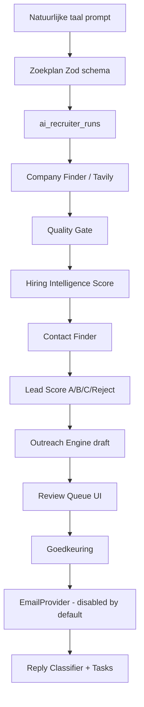

# HireFlow AI Recruiter

Autonome prospectresearch en outreach-voorbereiding — **geen verzending zonder menselijke goedkeuring**.

## Architectuur



### Integratie met bestaande modules

| Stap | Hergebruikt |
|------|-------------|
| Discovery | `CompanyFinderService` → Tavily via `ProviderManager` |
| Validatie | `discovery-quality-gate`, heuristics, AI classifier |
| Contacten | `ContactFinderService` + `recipient-selection.service` |
| Concepten | `OutreachEngine.createDraft()` |
| Verzending | `OutreachEngine.sendMessage()` + send rules |
| Scoring | Nieuwe transparante layer boven bestaande lead data |

## Database

Migration: `supabase/migrations/20250806100000_ai_recruiter.sql`

- `ai_recruiter_runs` — run lifecycle + counters + pipeline_steps
- `ai_recruiter_run_items` — per-bedrijf voortgang + scores
- `ai_recruiter_replies` — reply classificatie + follow-up metadata

RLS op `organization_id` via `current_organization_id()`.

**Actie:** `supabase db push`

## Routes

| Method | Path | Beschrijving |
|--------|------|--------------|
| POST | `/api/ai-recruiter/parse-plan` | NL → zoekplan |
| GET/POST | `/api/ai-recruiter/runs` | Lijst / aanmaken |
| GET | `/api/ai-recruiter/runs/[runId]` | Run + items |
| POST | `/api/ai-recruiter/runs/[runId]/start` | Start (→ stream URL) |
| GET | `/api/ai-recruiter/runs/[runId]/stream` | SSE live pipeline |
| POST | `/api/ai-recruiter/runs/[runId]/cancel` | Annuleren |

Outreach acties via bestaande `/api/outreach/messages/*`.

UI: `/ai-recruiter`

## Environment variables

```env
AI_RECRUITER_APPROVAL_MODE=manual
AI_RECRUITER_SEND_ENABLED=false
AI_RECRUITER_RUN_TIMEOUT_MINUTES=45
AI_RECRUITER_PROVIDER_FAILURE_KILL_SWITCH=3
OUTREACH_DRAFT_ONLY=true
OUTREACH_SENDER_EMAIL=jouw@zakelijk-domein.nl
TAVILY_API_KEY=...
OPENAI_API_KEY=...
```

## Veilige test-run — stappen

1. `supabase db push` (beide migrations: outreach + ai-recruiter)
2. Zet env vars (Tavily + OpenAI + OUTREACH_SENDER_EMAIL)
3. `npm run dev`
4. Ga naar **AI Recruiter** (`/ai-recruiter`)
5. Plak voorbeeldprompt → **Plan genereren** → controleer zoekplan + onzekerheden
6. Klik **Run starten** → volg live pipeline
7. Wacht tot status `awaiting_approval`
8. Selecteer prospect in review queue → **Goedkeuren**
9. Vul eigen e-mail → **Testmail** (via outreach API)

**Verstuur nooit naar prospects zonder expliciete bevestiging.**

## Testmail naar eigen adres

1. In review queue: prospect selecteren
2. Testmail-veld: `jouw@bedrijf.nl`
3. Klik **Testmail**
4. API: `POST /api/outreach/messages/[id]/send` met `{ confirmed: true, testRecipientEmail: "..." }`
5. Controleer inbox: onderwerp bevat `[TEST]`

## Testresultaten

```
✓ 35 tests (ai-recruiter + outreach-engine)
✓ typecheck clean
```

| # | Scenario | Status |
|---|----------|--------|
| 1 | NL → valide zoekplan | ✅ |
| 2 | Artikel/directory afgewezen | ✅ (via company-finder quality gate) |
| 3 | Echt bedrijf geaccepteerd | ✅ (orchestrator + discovery) |
| 4 | Duplicaat niet opnieuw opgeslagen | ✅ (company finder dedupe) |
| 5 | Hiring score | ✅ |
| 6 | Geen contact → geen concept | ✅ |
| 7 | Invalid e-mail → blokkeren | ✅ |
| 8 | Opt-out → blokkeren | ✅ |
| 9 | Geen goedkeuring → geen verzending | ✅ |
| 10 | Verkeerde afzender → blokkeren | ✅ |
| 11 | Daglimiet | ✅ |
| 12 | Idempotency | ✅ |
| 13 | Providerfout stopt run niet | ✅ (partially_completed) |
| 14 | Reply classificatie | ✅ |
| 15 | RLS cross-org | ⚠️ handmatig na migration |
| 16 | Timeout → partially_completed | ✅ |
| 17 | Gedeeltelijke run | ✅ |

## Security review

- RLS op alle nieuwe tabellen
- Geen API-keys/tokens in logs of SSE events
- Service-role alleen server-side (company saves)
- `AI_RECRUITER_SEND_ENABLED=false` default
- `OUTREACH_DRAFT_ONLY=true` default
- Suppression list + opt-out via outreach engine
- Audit via `outreach_events` + run counters
- Run timeout voorkomt permanent "running"

## Deployment

1. Push migrations naar Supabase
2. Zet env vars op Vercel
3. Deploy (geen commit gedaan in deze sprint)
4. Verifieer `/ai-recruiter` en `/api/ai-recruiter/parse-plan`

## Resterende beperkingen

- **Gmail reply polling** — `checkReplies()` stub; geen live inbox sync yet
- **Automatische taken** — reply follow-up actions gedefinieerd maar task creation nog niet volledig wired
- **Bulk approve in AI Recruiter UI** — individuele review werkt; bulk via Outreach dashboard
- **Article rejection test** — delegeert aan bestaande discovery quality gate
- **Campaign UI** — geen dedicated campagne-scherm
- **RLS productie** — handmatig verifiëren na migration

## Gewijzigde / nieuwe bestanden

```
supabase/migrations/20250806100000_ai_recruiter.sql
src/features/ai-recruiter/
src/app/api/ai-recruiter/
src/components/ai-recruiter/
src/app/(dashboard)/ai-recruiter/page.tsx
src/lib/ai-recruiter/stream-sse.ts
src/config/navigation.ts
docs/AI_RECRUITER.md
.env.example
```

Zie ook: [`docs/OUTREACH_ENGINE.md`](OUTREACH_ENGINE.md) voor e-mailverzending.
