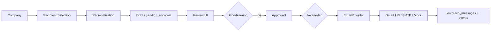

# HireFlow Outreach Engine

Veilige end-to-end e-mailflow voor prospectbenadering. **Standaard DRAFT_ONLY** — geen automatische verzending zonder expliciete gebruikersbevestiging.

## Architectuur



### Lagen

| Laag | Pad | Rol |
|------|-----|-----|
| Database | `supabase/migrations/20250805100000_outreach_engine.sql` | campaigns, messages, events, suppressions |
| Domain | `src/features/outreach-engine/domain/` | types, send rules |
| Recipient | `services/recipient-selection.service.ts` | contactprioriteit, validatie |
| Personalization | `services/personalization.service.ts` | NL e-mail, feiten-only |
| Engine | `services/outreach-engine.service.ts` | draft → approve → send |
| Email | `email/*-email-provider.ts` | Gmail, SMTP, Mock |
| API | `src/app/api/outreach/` | REST endpoints |
| UI | `src/components/outreach/outreach-dashboard.tsx` | review & verzenden |

## Database

Migration: `20250805100000_outreach_engine.sql`

- `outreach_campaigns` — campagneconfiguratie
- `outreach_messages` — individuele berichten + status
- `outreach_events` — audit trail (geen secrets)
- `outreach_suppressions` — opt-out / bounce blocklist
- `organization_email_connections` — OAuth/SMTP config (encrypted credentials)
- `companies.outreach_opt_out`, `contacts.outreach_opt_out`

RLS: alle tabellen gefilterd op `organization_id = current_organization_id()`.

## Environment variables

Zie `.env.example`. Minimaal voor testmail:

```env
OUTREACH_DRAFT_ONLY=true
OUTREACH_SENDER_EMAIL=jouw@zakelijk-domein.nl
OUTREACH_SENDER_NAME=HireFlow Group
```

Optioneel Gmail (voorkeur):

```env
GMAIL_CLIENT_ID=
GMAIL_CLIENT_SECRET=
GMAIL_REFRESH_TOKEN=
```

Optioneel Strato SMTP:

```env
SMTP_HOST=smtp.strato.com
SMTP_PORT=465
SMTP_USER=jouw@zakelijk-domein.nl
SMTP_PASS=
SMTP_SECURE=true
```

Veiligheidsschakelaars:

| Variable | Default | Effect |
|----------|---------|--------|
| `OUTREACH_DRAFT_ONLY` | `true` | Blokkeert prospect-verzending zonder `confirmed: true` |
| `OUTREACH_KILL_SWITCH` | `false` | Blokkeert alle verzending |
| `OUTREACH_DAILY_LIMIT` | `10` | Max mails/dag (testfase) |
| `OUTREACH_COMPANY_COOLDOWN_DAYS` | `30` | Cooldown per bedrijf |
| `OUTREACH_ENFORCE_SEND_WINDOW` | `true` | Werkdagen 08:30–17:30 NL |

## Gmail OAuth koppelen (Strato via Gmail)

1. Maak een Google Cloud project en schakel **Gmail API** in.
2. OAuth consent screen configureren (Internal of External).
3. OAuth client (Desktop of Web) aanmaken.
4. Refresh token verkrijgen met scope `https://www.googleapis.com/auth/gmail.send`.
5. Zet in `.env`:
   - `GMAIL_CLIENT_ID`, `GMAIL_CLIENT_SECRET`, `GMAIL_REFRESH_TOKEN`
   - `OUTREACH_SENDER_EMAIL` = exact het Strato-adres dat in Gmail staat als "Send mail as"
6. Verifieer via `GET /api/outreach/email/verify`.

**Belangrijk:** `OUTREACH_SENDER_EMAIL` moet exact overeenkomen met het geconfigureerde zakelijke adres. Het systeem weigert verzending vanuit een persoonlijk Gmail-adres.

## Strato SMTP koppelen

Als Gmail OAuth niet beschikbaar is:

```env
SMTP_HOST=smtp.strato.com
SMTP_PORT=465
SMTP_USER=jouw@hireflowgroup.nl
SMTP_PASS=<app-wachtwoord>
OUTREACH_SENDER_EMAIL=jouw@hireflowgroup.nl
```

Provider-volgorde: Gmail → SMTP → Mock (development/tests).

## API endpoints

| Method | Path | Beschrijving |
|--------|------|--------------|
| GET | `/api/outreach/messages` | Lijst berichten |
| POST | `/api/outreach/messages` | Concept aanmaken `{ companyId }` |
| GET/PATCH | `/api/outreach/messages/[id]` | Detail / bewerken |
| POST | `/api/outreach/messages/[id]/approve` | Goedkeuren |
| POST | `/api/outreach/messages/[id]/reject` | Afwijzen |
| POST | `/api/outreach/messages/[id]/send` | Verzenden `{ confirmed: true, testRecipientEmail? }` |
| GET | `/api/outreach/email/verify` | Provider + DRAFT_ONLY status |

## Veilige testmail — stappen

1. `supabase db push` — migration toepassen.
2. Zet `OUTREACH_DRAFT_ONLY=true` en `OUTREACH_SENDER_EMAIL` op je zakelijke adres.
3. Koppel Gmail OAuth of SMTP (zie boven).
4. Start app: `npm run dev`.
5. Ga naar **Companies** → kies prospect → **Outreach** (maakt concept).
6. Ga naar **Outreach** → selecteer concept → **Goedkeuren**.
7. Vul **jouw eigen e-mail** in bij Testmail → **Testmail versturen**.
8. Controleer inbox: onderwerp bevat `[TEST]`, ontvanger is jouw adres (niet de prospect).

**Verzend nooit naar prospects zonder expliciete bevestiging in de UI.**

## Verzendregels

- Standaard `DRAFT_ONLY=true`
- Max 10 mails/dag (testfase)
- 30 dagen cooldown per bedrijf
- Geen verzending buiten 08:30–17:30 NL werkdagen
- Idempotency key per bericht
- Max 2 retries met exponential backoff
- Kill switch via `OUTREACH_KILL_SWITCH=true`
- Nooit opnieuw verzenden na status `sent`
- Opt-out via `outreach_suppressions` + company/contact flags

## Testresultaten

Tests: `npm test -- src/features/outreach-engine`

| # | Scenario | Status |
|---|----------|--------|
| 1 | Geen ontvanger → geen verzending | ✅ |
| 2 | Ongeldig e-mailadres → blokkeren | ✅ (recipient-selection) |
| 3 | Duplicaat → blokkeren | ✅ |
| 4 | Geen goedkeuring → niet verzenden | ✅ |
| 5 | Testmail naar eigen adres | ✅ |
| 6 | Correct zakelijk From-adres | ✅ |
| 7 | Bericht één keer verzonden | ✅ (already_sent) |
| 8 | Providerfout → failed/retry | ✅ |
| 9 | Retry werkt | ✅ |
| 10 | Daglimiet werkt | ✅ |
| 11 | Cooldown werkt | ✅ (recipient-selection) |
| 12 | RLS andere org | ⚠️ DB migration — handmatig verifiëren |
| 13 | Opt-out blokkeert | ✅ (recipient-selection) |

## Resterende beperkingen

- **Bulk approve API** — UI toont selectie nog niet volledig; individuele review werkt.
- **Campaign CRUD UI** — campagnes via DB/API, geen dedicated UI.
- **Gmail OAuth flow UI** — credentials via env; geen in-app OAuth wizard.
- **SMTP provider** — experimenteel; productie voorkeur Gmail API.
- **Automatische verzending** — technisch voorbereid (`approval_mode: automatic`) maar standaard uit.
- **Reply/bounce webhooks** — status `replied`/`bounced` handmatig of toekomstige integratie.
- **Migration moet nog gepusht** naar Supabase productie.

## Beveiligingsmaatregelen

- RLS op alle outreach-tabellen
- Geen API-keys/tokens in `outreach_events` metadata
- Afzender-validatie tegen `OUTREACH_SENDER_EMAIL`
- DRAFT_ONLY + expliciete `confirmed: true` in send API
- Testmails alleen naar opgegeven `testRecipientEmail`
- Kill switch en daglimiet
- Suppression list voor opt-out
